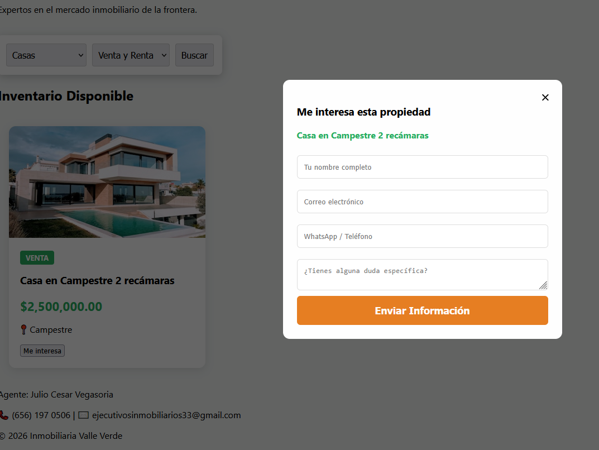
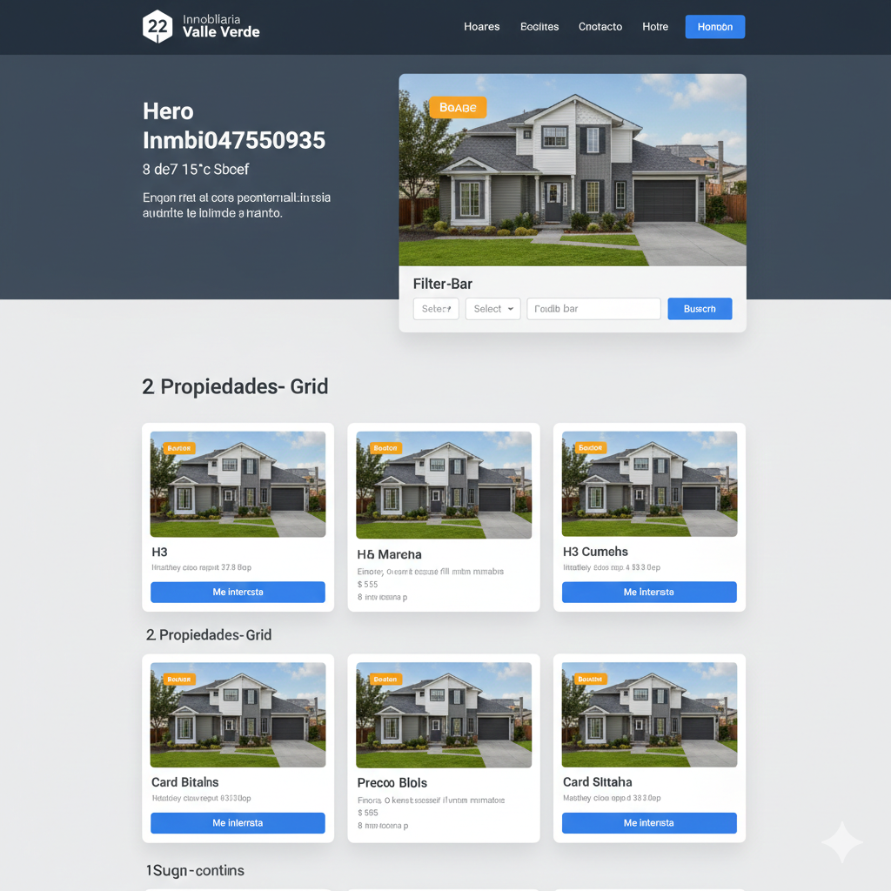

# UI/UX

This document describes the user interface and user experience design principles, wireframes, and mockups for the project.
# UI/UX Notes

## Design Principles
- Clean and modern
- Mobile-first
- Accessible
- Fast and intuitive

## Branding
- Colors: Green, white, dark gray
- Tone: Professional, trustworthy, friendly

## Pages
### Home Page
- Hero section
- Featured properties
- Contact CTA

### Property Page
- Image gallery
- Property details
- Agent info
- Contact form

### Dashboard (Future)
- Agent performance
- Leads overview
- Property management

## User Flow – Property Inquiry
1. User views property
2. User clicks “Contact Agent”
3. Form submission
4. Lead created in CRM
5. Agent receives notification

